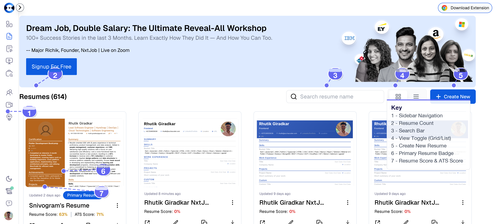
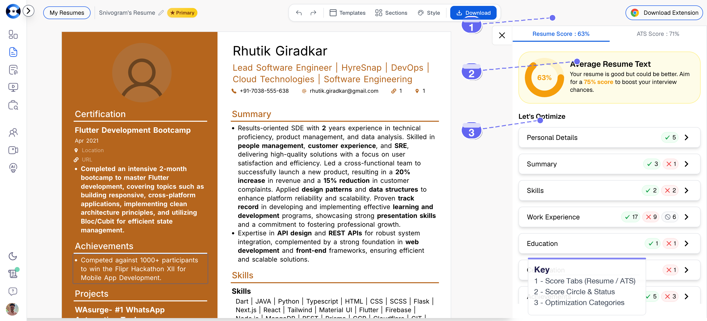

# NxtJob Resume Builder — The Complete Product Guide (v2)

> **Product URL:** [https://resume.nxtjob.ai](https://resume.nxtjob.ai)
> **Platform:** [https://nxtjob.ai](https://nxtjob.ai)
> **Audience:** Senior working professionals (5-20+ years experience)
> **Version:** 2.0
> **Last Updated:** February 2026

---

## Table of Contents

1. [Introduction & What NxtJob Solves](#1-introduction--what-nxtjob-solves)
2. [Getting Started](#2-getting-started)
3. [Resume Dashboard](#3-resume-dashboard)
4. [Resume Cards](#4-resume-cards)
5. [Searching & Browsing](#5-searching--browsing)
6. [Creating a Resume](#6-creating-a-resume)
7. [Resume Actions](#7-resume-actions)
8. [Primary Resume](#8-primary-resume)
9. [Pagination & Navigation](#9-pagination--navigation)
10. [Resume Builder](#10-resume-builder)
11. [Resume Score — The Complete Playbook](#11-resume-score--the-complete-playbook)
12. [ATS Score](#12-ats-score)
13. [AI-Powered Features](#13-ai-powered-features)
14. [Pro Tips for Senior Professionals](#14-pro-tips-for-senior-professionals)

---

## 1. Introduction & What NxtJob Solves

### The Problem for Senior Professionals

If you are a senior professional with 5, 10, or 20+ years of experience, the job market feels fundamentally different from when you last searched. Applicant Tracking Systems now reject up to 75% of resumes before a human ever reads them. The resume that landed you your current role five years ago is almost certainly not optimized for today's hiring landscape. And as a busy professional, you do not have time to become an expert in ATS algorithms, keyword density, or resume scoring heuristics.

You need a tool that understands your seniority level, respects the depth of your career, and guides you through modern resume optimization without requiring you to start from scratch.

### The NxtJob Ecosystem

NxtJob.ai is an end-to-end job change platform built specifically for senior professionals who want to accelerate career transitions and negotiate better compensation. The platform's promise is direct: **get a salary hike in just 90 days.**

The ecosystem includes six integrated tools:

| Tool | URL | Purpose |
|---|---|---|
| **Resume Builder** | resume.nxtjob.ai | AI-powered resume creation and optimization |
| **Job Board & Tracking** | jobs.nxtjob.ai | Kanban-style job pipeline management |
| **Interview Prep** | interview.nxtjob.ai | Mock interviews with AI-driven feedback |
| **Cover Letter Generator** | Built into the platform | AI-powered cover letters tailored to job descriptions |
| **Chrome Extension** | Chrome Web Store | LinkedIn optimization and multi-board job scraping |
| **Community** | Accessible from sidebar | Peer networking and career guidance |

Every tool feeds into the next. Your Resume Builder output connects to the Job Board. Your Job Board applications link to Interview Prep. The Chrome Extension scrapes job postings directly into your pipeline. The 90-day journey is designed to be seamless.

### Why the Resume Builder Is the Starting Point

Your resume is the foundation of every job application. It determines whether you pass ATS filters, whether a recruiter spends more than six seconds on your profile, and whether you get invited to interview. The NxtJob Resume Builder is where your 90-day journey begins.

This guide covers every feature of the Resume Builder in detail, with particular depth on the scoring and optimization systems that will transform your resume from a generic career summary into a targeted, ATS-optimized, recruiter-ready document.

> **Pro Tip:** As a senior professional, your time is valuable. Bookmark this guide and use the Table of Contents to jump directly to the section you need. The [Resume Score Playbook](#11-resume-score--the-complete-playbook) is the section you will return to most often.

---

## 2. Getting Started

### First Login

1. Navigate to [https://resume.nxtjob.ai](https://resume.nxtjob.ai).
2. Sign in with your NxtJob.ai account (Google SSO, LinkedIn, or email).
3. You land on the **My Resumes** dashboard at `resume.nxtjob.ai/all`.

If this is your first visit, the dashboard will be empty with a prominent **+ Create New** button. If you have used NxtJob before, all your existing resumes appear as cards in a paginated grid.

### What You See

The interface is divided into three zones:

- **Left Sidebar** — Navigation to all NxtJob tools: Dashboard, Cover Letters, Interview Prep, Jobs, Community, Videos, and Omega. This sidebar persists across all pages.
- **Top Bar** — Your profile avatar, dark mode toggle, help resources, and notification controls.
- **Main Content Area** — The resume grid, search bar, view toggles, and pagination controls.



> **Pro Tip:** Enable dark mode from the top-right toggle if you work late hours. Reducing eye strain during extended resume editing sessions makes a real difference.

---

## 3. Resume Dashboard

### The Command Center for Your Career Documents

The My Resumes dashboard at `resume.nxtjob.ai/all` is your single pane of glass for every resume you have built. The page header displays your total resume count (for example, **Resumes (614)**), giving you an immediate inventory of your resume portfolio.

### Dashboard Capabilities

From the dashboard, you can perform every resume management task without navigating away:

| Action | How |
|---|---|
| Create a new resume | Click **+ Create New** (top-right) |
| Search your library | Type in the search bar |
| Switch layout | Toggle between Grid and List view icons |
| Edit any resume | Click the pencil icon on any card |
| Preview a resume | Use the three-dot menu on any card |
| Download as PDF | Click the download icon on any card |
| Duplicate a resume | Click the copy icon on any card |
| Set primary resume | Use the three-dot menu, select "Mark Primary" |
| Delete a resume | Use the three-dot menu, select "Delete" |
| Share a resume link | Click the share icon on any card |
| Rename a resume | Use the three-dot menu, select "Rename" |
| Navigate pages | Use pagination controls at the bottom |

### Left Sidebar Navigation

The sidebar provides quick access to the full NxtJob ecosystem:

- **Dashboard** — Returns to the My Resumes page
- **Cover Letters** — Access the AI cover letter generator
- **Interview Prep** — Launch mock interview sessions
- **Jobs** — Open the job board and application tracker
- **Community** — Connect with other professionals
- **Videos** — Access tutorial and career advice content
- **Omega** — Advanced NxtJob features

> **Pro Tip:** Bookmark `resume.nxtjob.ai/all` so you can jump straight to your resume library from any browser. If you are in the middle of a job search, make it a browser startup page.

---

## 4. Resume Cards

### Anatomy of a Resume Card

Every resume in your library is represented as a card. Each card is a compact, information-dense summary of that document. Here is what you see at a glance:

| Element | Description |
|---|---|
| **Thumbnail Preview** | A miniature rendering of the full first page of your resume, showing the actual template and formatting. |
| **Resume Name** | The title you assigned (e.g., "VP Engineering - Acme Corp - Feb 2026"). |
| **Last Updated** | A relative timestamp such as "Updated 3 days ago," reflecting the last time any change was saved. |
| **Resume Score** | A percentage (e.g., 63%) in color-coded text: green (75%+), yellow (50-74%), or red (below 50%). |
| **ATS Score** | A percentage (e.g., 71%) shown only on resumes that have been evaluated against a job description. |
| **Primary Badge** | A blue "Primary Resume" label on the resume designated as your default for applications. |
| **Quick Action Icons** | A row of icons at the bottom: Share/Open, Edit (pencil), Duplicate (copy), Download (arrow), and a three-dot menu for additional options. |


### Score Display on Cards

The Resume Score and ATS Score are displayed directly on each card so you can assess quality without opening the builder. The color coding provides instant triage:

- **Green text** — This resume is strong. Ready for applications.
- **Yellow text** — This resume has a solid foundation but needs optimization.
- **Red text** — This resume needs significant work before submission.

### The "Updated X Days Ago" Timestamp

This timestamp reflects the last time any change was saved to that resume, including text edits, formatting changes, section reordering, or template switches. Use it to identify which version is most current, especially when maintaining multiple variants for different roles.

> **Pro Tip:** If a card shows "Updated 6+ months ago," the optimization engine will flag this in your Resume Score. Resumes go stale. Job descriptions evolve. Industry terminology shifts. Make it a habit to review and update every resume at least every six months.

---

## 5. Searching & Browsing

### Search by Name

1. Locate the **"Search resume name"** input field at the top of the dashboard.
2. Type any part of the resume name (e.g., "Backend" or "VP Engineering").
3. The grid updates in real time to display only matching resumes.
4. Clear the search field to return to the full list.


### Grid View vs. List View

Two toggle buttons sit next to the search bar:

- **Grid View** — Visual card layout with thumbnail previews. Best for scanning designs and comparing templates across resumes.
- **List View** — Compact text-based table. Best for managing a large library where you need to see names, scores, and dates at a glance without visual clutter.

### Strategies for Large Libraries

If you maintain dozens or hundreds of resumes (common for senior professionals who tailor documents per application), combine these strategies:

1. **Search by name** to narrow results immediately.
2. **Scan the Primary badge** to spot your default resume.
3. **Use pagination** (bottom of page) to jump to a specific page.
4. **Use List View** for faster scanning of large collections.

> **Pro Tip:** Adopt a consistent naming convention such as `[Role] - [Company] - [Month Year]` (e.g., "VP Engineering - Acme Corp - Feb 2026"). This makes search highly effective and keeps your library organized even at scale.

---

## 6. Creating a Resume

### Step by Step

1. On the My Resumes dashboard, click the blue **+ Create New** button in the top-right area.
2. Follow the on-screen prompts to choose a template, import an existing document, or start from a blank canvas.
3. The new resume opens immediately in the Resume Builder for editing.


### What Happens Behind the Scenes

When you click **+ Create New**, NxtJob creates a new resume document linked to your account. You may be offered several starting paths:

- **Choose a Template** — Select from professionally designed layouts optimized for ATS compatibility.
- **Import** — Upload an existing resume (PDF or DOCX) and NxtJob will parse it into editable sections.
- **Blank Canvas** — Start with an empty structure and build from scratch.

Once you make your selection, the full Resume Builder interface opens and you can begin populating every section.

### Multiple Resumes for Different Roles

NxtJob places no practical limit on the number of resumes you can create. Senior professionals commonly maintain separate resumes tailored to different target roles, industries, or seniority levels. Each resume is an independent document with its own name, content, scores, template, and styling.

Common resume variants for a senior professional:

| Variant | Purpose |
|---|---|
| **Primary / General** | Your strongest all-purpose resume, always ready for quick applications |
| **Role-Specific** | Tailored for a specific job title (e.g., "VP Engineering" vs. "CTO") |
| **Industry-Specific** | Adjusted for different industries (e.g., FinTech vs. HealthTech) |
| **Company-Specific** | Customized for a particular company's job description |

> **Pro Tip:** Maintain at least three resume variants: one for your primary target role, one for an adjacent role, and one as a general-purpose document. Tailoring increases both Resume Score and ATS Score because each variant can be optimized for a different keyword set.

---

## 7. Resume Actions

Every resume card provides a set of quick actions at the bottom of the card, plus an expanded menu behind the **three-dot (...)** icon.


### Mark Primary

Sets the selected resume as your default. This is the resume attached automatically when you apply to jobs through NxtJob.ai. Only one resume can be primary at a time; selecting a new one removes the badge from the previous primary. Access via the three-dot menu.

### Preview

Opens a read-only rendering of the resume, showing exactly how it looks when downloaded or shared. Use this to perform a final visual check before submitting. Access via the three-dot menu.

### Edit

Opens the full Resume Builder at a URL like `resume.nxtjob.ai/{resume-id}?tab=score`. You have full control over every section, template, and styling option. Access via the pencil icon or the three-dot menu.

### Download

Exports the resume as a PDF file to your local device. The PDF preserves all formatting, fonts, and layout exactly as displayed in the builder. Access via the download arrow icon or the three-dot menu.

### Rename

Opens a dialog where you can change the resume's title. Useful when repurposing a resume for a different role or updating the naming convention. Access via the three-dot menu.

### Duplicate

Creates an exact copy of the resume with the same content, formatting, and template. The duplicate appears in your library with a modified name (typically appended with "Copy"). Access via the copy icon or the three-dot menu.

> **Pro Tip:** Duplicating is the fastest way to create a role-specific variant. Duplicate your strongest resume, rename it for the target role, and adjust the summary, skills, and keywords. This preserves your proven formatting while allowing targeted optimization.

### Delete

Permanently removes the resume from your library. **Deleted resumes cannot be recovered.** Access via the three-dot menu.

> **Pro Tip:** Before deleting any resume, download a PDF copy as a backup. If there is any chance you will need the content again, duplicate and archive rather than delete.

### Share

Generates a shareable link for the resume. You can send this link directly to recruiters, hiring managers, or include it on portfolio pages. The shared view is a clean, read-only rendering. Access via the share icon on the card.

---

## 8. Primary Resume

### What It Is

Your **Primary Resume** is the default document associated with your NxtJob.ai profile. It serves three critical functions:

1. **Auto-attachment** — When you apply to jobs through NxtJob.ai's Jobs feature, your primary resume is attached by default.
2. **Profile representation** — Your primary resume may be surfaced in the NxtJob Community or shown to recruiters who view your profile.
3. **Quick access** — The blue "Primary Resume" badge makes it instantly identifiable in a large library.

### Why It Matters for Senior Professionals

When you are actively job hunting and applying to multiple positions per week, having a polished primary resume saves significant time. You can apply with one click, knowing your strongest document is being sent. For positions requiring a more targeted resume, you can override the default during the application flow.

### How to Set It

1. Click the **three-dot (...)** icon on the resume card you want to designate.
2. Select **Mark Primary**.
3. The blue "Primary Resume" badge transfers to the selected card.

### Changing Your Primary

You can change your primary resume at any time by repeating the steps above on a different resume. The badge automatically transfers. There is no limit on how often you can switch.

> **Pro Tip:** Keep your primary resume as your most polished, general-purpose document. Update it every time you gain a new achievement, certification, or role change. A stale primary resume is a missed opportunity.

---

## 9. Pagination & Navigation

### Page Controls

At the bottom of the dashboard, pagination controls display numbered page buttons (e.g., **Previous, 1, 2, 3, 4, 5, Next**). Click any page number to jump directly, or use **Previous** and **Next** to step through sequentially.

### Resumes Per Page

The dashboard displays a fixed number of resume cards per page. The exact count depends on your view mode (Grid vs. List) and screen resolution. With large libraries (e.g., 614 resumes), multiple pages are generated automatically.

### Navigating Efficiently

For large libraries, pagination combined with search is the most efficient approach:

1. If you know the name, use search.
2. If you are browsing recent work, check the first page (typically sorted by last updated).
3. If you need to find your primary resume, scan for the blue badge.

> **Pro Tip:** If pagination becomes unwieldy, it may be time to clean house. Delete or archive outdated resumes that you no longer need. A focused library with 10-20 well-maintained resumes is more effective than hundreds of abandoned drafts.

---

## 10. Resume Builder

### Overview of the Builder Interface

The Resume Builder is the core editing environment where you craft, refine, and optimize your resume. When you open a resume for editing, you arrive at a URL like `resume.nxtjob.ai/{resume-id}?tab=score`.

The interface is divided into three main areas:

1. **Top Toolbar** — Controls for Templates, Sections, Style, and Download.
2. **Left Panel (Editor)** — The full resume document with editable sections, inline formatting, and page break indicators.
3. **Right Panel (Score & Optimization)** — The scoring panel with Resume Score and ATS Score tabs, plus the full optimization breakdown.

A **"My Resumes"** link at the top navigates back to the dashboard. The resume name and a **"Primary"** star badge (if applicable) are displayed prominently.


### Top Toolbar

#### Templates

Browse and apply pre-designed resume layouts. Changing templates reformats your content without losing any data. NxtJob offers templates optimized for different industries, seniority levels, and ATS compatibility levels.

#### Sections

Add, remove, or reorder resume sections. Available sections include:

- Personal Details
- Summary
- Skills
- Work Experience
- Projects
- Education
- Certifications
- Achievements
- Languages
- Custom Sections (any title and content structure you define)

#### Style

Adjust visual properties to match your personal brand:

- **Fonts** — Select from professional typefaces
- **Colors** — Choose accent colors for headings and highlights
- **Spacing** — Control line spacing and section gaps
- **Margins** — Adjust page margins

#### Download

Export the current resume as a PDF directly from the builder. The PDF preserves all formatting exactly as displayed.

> **Pro Tip:** Choose a clean, single-column template for maximum ATS compatibility. Multi-column layouts can confuse some tracking systems, and text embedded in tables or graphics may be silently dropped during parsing.

### Editable Resume Sections

#### Personal Details

Your name, professional title/headline, phone number, email address, location, and links (LinkedIn, portfolio, GitHub, etc.). This section appears at the top of your resume and is critical for recruiter contact.

#### Summary

A rich-text paragraph summarizing your professional identity, core competencies, and career value proposition. The editor supports **bold** formatting for emphasis on key terms. Write a summary that leads with your years of experience and domain expertise.

#### Skills

Skills are organized into **buckets** (groupings by category) with individual skills displayed as tags. For example, a bucket titled "Cloud & Infrastructure" might contain tags like AWS, Kubernetes, Terraform, and Docker.

#### Work Experience

Each entry includes job title, company name, employment dates, location, and bullet points describing accomplishments. The editor supports **bold formatting** within bullets for highlighting key metrics and technologies.

#### Projects

Project entries include project name, dates, description bullets, and optional links. Structure bullets the same way as Work Experience: action verb + task + measurable result.

#### Education

Each entry includes degree type, field of study, institution name, dates, location, and optional GPA.

#### Certifications

Each entry includes certification name, issuing organization, date earned, and optional verification URL.

#### Achievements

A bullet-point list of notable accomplishments such as awards, patents, publications, speaking engagements, or leadership milestones.

#### Languages

Languages with proficiency levels (Native, Fluent, Conversational, Basic).

#### Custom Sections

Create sections with any title and content structure for categories like Volunteer Work, Board Memberships, Open Source Contributions, or Publications.

### Section Action Buttons

Every section in the builder has a set of action buttons:

| Button | Function |
|---|---|
| **AI Generate** | Uses NxtJob's AI to auto-generate or enhance content for that section. |
| **Move Up / Move Down** | Reorders the section relative to others on the resume. |
| **Settings** | Opens section-specific configuration (visibility, layout options). |
| **Delete** | Removes the section from the resume entirely. |

> **Pro Tip:** Use **AI Generate** on your Summary and Work Experience sections first. The AI produces strong initial drafts using the CAR framework (Challenge, Action, Result) that you can then refine with your personal voice and specific numbers.

---

## 11. Resume Score — The Complete Playbook

This is the most important section of this guide. The Resume Score system is your roadmap to transforming a weak resume into one that consistently lands interviews. Follow this playbook step by step to take your score from the red zone to the green zone.

### How the Score Is Calculated

The Resume Score uses a straightforward formula:

```
Score = (Correct Checks / Total Active Checks) x 100
```

Every optimization rule is evaluated as either **correct** (your resume passes) or **incorrect** (your resume fails). Rules that are disabled or not applicable are excluded from the total. Your score is the percentage of rules you pass.

This means every single rule carries equal weight. Fixing even one small issue raises your score. There are no hidden multipliers or subjective judgments. The system is transparent and deterministic.

### Score Thresholds and What They Mean

| Score Range | Color | Label | What It Means |
|---|---|---|---|
| **Below 50%** | Red | "Improve resume score" | Your resume has critical gaps. Most ATS systems and human reviewers will flag concerns. Prioritize fixing red-flagged items immediately. |
| **50% to 74%** | Yellow | "Average Resume Text" | Your resume has a solid foundation but is leaving points on the table. With targeted optimization, you can reach the green zone. |
| **75% and above** | Green | "Good Resume Text" | Your resume meets professional standards. Focus on fine-tuning and role-specific optimization. |

**Your target:** 75%+ for every resume you submit. For highly competitive senior roles, aim for 85%+.



### The Optimization Panel

The right panel of the Resume Builder contains a **"Let's Optimize"** section that breaks down your score by category. Each category displays colored indicators (green, yellow, red) and a count of checks passed vs. total checks.

Click into any category to see specific, actionable recommendations. Each recommendation tells you exactly what to fix and why.


### The Step-by-Step Playbook: From 40% to 90%+

Work through these sections in order. Each section is listed with every rule the scoring engine evaluates, along with examples and fix strategies.

---

### A. Overall Resume

These rules evaluate your resume as a whole document, independent of any specific section.

#### Rule 1: Resume Length (450-850 Words)

**What it checks:** Your total word count should fall between 450 and 850 words.

**Why it matters:** Too short and you appear inexperienced or underprepared. Too long and recruiters lose interest, and ATS systems may truncate content. The 450-850 range is the sweet spot for senior professionals with substantial experience who need to be concise.

**How to fix:**
- If too short: Add more bullet points to Work Experience, expand your Summary, or add a Projects or Achievements section.
- If too long: Trim older roles (10+ years ago) to 0-3 bullets, remove redundant skills, and tighten verbose bullet points.

> **Pro Tip:** A common mistake for senior professionals is trying to include everything from a 20-year career. Be selective. Your resume is a highlight reel, not a comprehensive autobiography.

#### Rule 2: Reverse Chronological Order (HIGH IMPACT)

**What it checks:** Your Work Experience entries are ordered from most recent to oldest.

**Why it matters:** This is one of the highest-impact rules. Virtually every recruiter and ATS system expects reverse chronological order. Your most recent and relevant role should be the first thing they see.

**How to fix:** Use the Move Up / Move Down buttons in the builder to reorder entries. Most recent role goes first.

#### Rule 3: Critical Sections Present

**What it checks:** Your resume includes all five essential sections:
1. Personal Details
2. Summary
3. Skills
4. Work Experience
5. Education

**Why it matters:** Missing any of these sections is a red flag for both ATS systems and human reviewers. Each section serves a distinct purpose in establishing your professional credibility.

**How to fix:** Use the **Sections** menu in the top toolbar to add any missing sections.

#### Rule 4: Number of Sections (5-8)

**What it checks:** Your resume has between 5 and 8 sections total.

**Why it matters:** Fewer than 5 sections suggests incomplete content. More than 8 sections creates clutter and dilutes focus. The ideal range balances thoroughness with readability.

**How to fix:** For senior professionals, a strong section lineup is: Personal Details, Summary, Skills, Work Experience, Projects (optional), Education, Certifications (if relevant), Achievements (if notable). That gives you 6-8 sections.

#### Rule 5: Shorten URLs

**What it checks:** Any URLs in your resume are under 30 characters.

**Why it matters:** Long URLs waste valuable resume space, look unprofessional, and can break across lines in ways that confuse ATS parsers.

**How to fix:** Use URL shorteners (bit.ly, tinyurl) or LinkedIn's custom URL feature to create clean links. For example, change `https://www.linkedin.com/in/firstname-lastname-123456789/` to `linkedin.com/in/firstname-lastname`.

#### Rule 6: Buzz Words (Max 2 Instances)

**What it checks:** Your resume contains no more than 2 instances of recognized buzz words. The system checks for 88+ buzz words including:

- Very, Highly, Extremely
- Proactive, Synergy, Paradigm shift
- Think outside the box, Results-oriented, Results-driven
- Team player, Go-getter, Self-starter
- Detail-oriented, Dynamic, Seasoned
- Expert, Rockstar, Ninja, Guru
- Best of breed, Leverage, Ecosystem
- Passionate, Motivated, Dedicated
- Hard-working, People person

**Why it matters:** These words are vague, overused, and tell the reader nothing specific about your capabilities. Recruiters who read hundreds of resumes develop an instant negative reaction to buzzword-heavy content. They want evidence, not adjectives.

**How to fix:** Replace every buzz word with a specific, quantified achievement.

| Instead of... | Write... |
|---|---|
| "Results-oriented leader" | "Led 12-person engineering team that shipped 3 products generating $4.2M ARR" |
| "Dynamic team player" | "Collaborated with Product, Design, and QA teams to reduce release cycle from 6 weeks to 2 weeks" |
| "Seasoned expert in cloud computing" | "Architected AWS migration for 200+ microservices, reducing infrastructure costs by 34%" |
| "Passionate about innovation" | "Filed 4 patents in distributed systems; 2 granted, 2 pending" |

#### Rule 7: Revision Date (Update Every 6 Months)

**What it checks:** Your resume has been updated within the last 6 months.

**Why it matters:** An outdated resume may contain stale information, miss recent achievements, and lack current industry keywords. The job market evolves, and your resume should evolve with it.

**How to fix:** Open and update your resume at least every 6 months. Add recent accomplishments, update your skills section with new technologies, and refresh your summary.

#### Rule 8: Soft Skills Coverage (7 Categories)

**What it checks:** Your resume demonstrates soft skills across 7 categories, with at least 2 keyword matches in each category. The system scans your entire resume for these action words.

This is one of the most comprehensive rules and has a significant impact on your score. Here are all 7 categories with their recognized keywords:

**1. Leadership**
> Directed, Guided, Championed, Led, Inspired, Spearheaded, Mentored, Supervised, Orchestrated, Oversaw, Delegated, Empowered, Mobilized, Steered, Captained

*Example:* "**Mentored** 8 junior engineers; 3 promoted to senior within 18 months. **Spearheaded** the company's first platform engineering initiative."

**2. Communication**
> Collaborated, Negotiated, Presented, Advocated, Communicated, Articulated, Briefed, Corresponded, Conveyed, Persuaded, Mediated, Facilitated, Authored, Published

*Example:* "**Presented** quarterly architecture reviews to C-suite. **Negotiated** vendor contracts saving $1.2M annually."

**3. Teamwork**
> Coordinated, Unified, Harmonized, Partnered, Cooperated, Integrated, Supported, Contributed, Assisted, Engaged, Fostered, Cultivated

*Example:* "**Coordinated** cross-functional team of 15 across 3 time zones. **Fostered** engineering culture that improved team retention by 25%."

**4. Analytical & Problem Solving**
> Analyzed, Diagnosed, Strategized, Optimized, Researched, Investigated, Evaluated, Assessed, Resolved, Deciphered, Interpreted, Identified, Examined, Dissected

*Example:* "**Analyzed** production incident patterns and **optimized** monitoring stack, reducing mean time to resolution from 4 hours to 22 minutes."

**5. Initiative & Drive**
> Spearheaded, Pioneered, Innovated, Initiated, Launched, Founded, Established, Introduced, Proposed, Designed, Created, Developed, Originated, Devised

*Example:* "**Pioneered** the adoption of event-driven architecture. **Launched** internal developer platform used by 200+ engineers."

**6. Adaptability**
> Adapted, Pivoted, Navigated, Transitioned, Embraced, Transformed, Evolved, Adjusted, Recalibrated, Restructured, Modernized, Revamped, Overhauled

*Example:* "**Navigated** org restructuring, successfully **transitioning** team from monolith to microservices architecture without production downtime."

**7. Time & Project Management**
> Coordinated, Prioritized, Managed, Scheduled, Organized, Streamlined, Implemented, Executed, Delivered, Planned, Tracked, Allocated, Budgeted, Monitored

*Example:* "**Managed** $3.5M annual infrastructure budget. **Streamlined** deployment pipeline, reducing release frequency from monthly to daily."

**How to fix:** Review your Work Experience bullet points and ensure you are using action verbs from all 7 categories. You do not need to force every category into every role, but across your entire resume, each category should have at least 2 matching keywords.

> **Pro Tip:** Print out the 7 soft skill categories and tape them next to your screen while editing. As you write each bullet point, consciously choose action verbs from categories you are under-representing. This single habit can boost your score by 10-15 points.

---

### B. Personal Details

These rules evaluate the contact and identity section at the top of your resume.

#### Rule 1: Title/Headline Length (50-100 Characters)

**What it checks:** Your professional headline is between 50 and 100 characters.

**Why it matters:** Too short and you miss an opportunity to establish expertise. Too long and it wraps awkwardly or gets truncated.

**Good examples:**
- "Senior Engineering Manager | Stripe | Cloud Infrastructure & Platform" (70 chars)
- "VP of Product | B2B SaaS | Growth Strategy & Go-to-Market" (57 chars)
- "Principal Software Architect | FinTech | Distributed Systems & ML" (65 chars)

**Bad examples:**
- "Software Engineer" (17 chars — too short, too generic)
- "Highly experienced and passionate technology leader with deep expertise in cloud computing, artificial intelligence, and machine learning across multiple industries" (162 chars — far too long)

#### Rule 2: Professional Email

**What it checks:** Two things:
1. Your email does not contain a birth year (e.g., john.smith1985@gmail.com).
2. Your email does not contain buzz words (ninja, wizard, guru, rockstar, etc.).

**Why it matters:** Your email is a subtle professionalism signal. Birth years invite age bias. Novelty handles undermine credibility at the senior level.

**Good:** john.smith@gmail.com, j.smith@company.com, johnsmith.dev@gmail.com
**Bad:** john.ninja1985@gmail.com, codewizard42@yahoo.com, rockstar_john@gmail.com

#### Rule 3: Location Format

**What it checks:** Your location field is under 40 characters and follows a City + State/Country format.

**Good:** "San Francisco, CA" / "London, United Kingdom" / "Singapore"
**Bad:** "123 Main Street, Apartment 4B, San Francisco, California, 94102, United States"

#### Rule 4: Critical Fields Present

**What it checks:** All five critical contact fields are filled:
1. Name
2. Email
3. Phone
4. Location
5. LinkedIn URL

**Why it matters:** Missing any of these fields creates friction for recruiters. A missing phone number or LinkedIn URL can cause a recruiter to pass on your resume entirely, because following up becomes harder.

#### Rule 5: Completeness

**What it checks:** Every available field in the Personal Details section is filled, including optional fields like portfolio URL, GitHub, or personal website.

> **Pro Tip:** For senior professionals, a LinkedIn URL is non-negotiable. If your LinkedIn profile URL is long, customize it at linkedin.com/public-profile/settings to create a clean URL like `linkedin.com/in/yourname`.

---

### C. Summary

These rules evaluate the professional summary paragraph at the top of your resume.

#### Rule 1: Length (30-120 Words)

**What it checks:** Your summary is between 30 and 120 words.

**Why it matters:** Under 30 words feels incomplete and misses the opportunity to frame your career narrative. Over 120 words becomes a wall of text that recruiters will skip entirely.

**Targeting the sweet spot:** For senior professionals, aim for 60-100 words. This gives you enough room to establish your experience level, domain expertise, and 1-2 headline achievements.

#### Rule 2: Quantification (At Least 1 Number/Metric)

**What it checks:** Your summary contains at least one numerical value or metric.

**Why it matters:** Numbers are the single most effective way to demonstrate impact. A summary without numbers is a summary without proof.

**Before (no numbers):**
> "Experienced engineering leader with extensive background in building scalable platforms and managing large teams across multiple organizations."

**After (quantified):**
> "Engineering leader with **14 years** of experience building scalable platforms serving **50M+ users**. Managed teams of up to **45 engineers** across 3 organizations, delivering **$12M+** in annual revenue impact."

#### Rule 3: No Objective Words

**What it checks:** Your summary does not contain objective-statement language:
- "Objective"
- "Seeking"
- "To obtain"
- "Looking for"

**Why it matters:** Objective statements are an outdated resume convention. They tell the recruiter what you want rather than what you offer. Modern resumes lead with value, not requests.

**Before:** "Seeking a senior engineering role at an innovative company where I can leverage my skills."
**After:** "Senior engineering leader who has scaled 3 platform teams from seed stage to Series C, delivering 99.99% uptime across distributed systems serving 50M+ daily active users."

#### Rule 4: Bullet Points

**What it checks:**
- If your summary is under 70 words: no bullet points needed (paragraph format is fine).
- If your summary is 70+ words: it should use 2-4 bullet points for readability.

**Why it matters:** Long paragraphs are hard to scan. Bullet points allow recruiters to quickly extract key information during their initial 6-second scan.

> **Pro Tip:** Structure your summary as a 1-2 sentence opening paragraph followed by 2-3 bullet points highlighting your biggest achievements. This hybrid format gives you the best of both worlds: narrative context plus scannable highlights.

---

### D. Skills

These rules evaluate how your skills section is structured and populated.

#### Rule 1: Categorization (2+ Titled Skill Buckets)

**What it checks:** Your skills are organized into at least 2 named categories (buckets).

**Why it matters:** A flat list of 20 skills is hard to parse. Categories create visual structure and help recruiters quickly find relevant competencies.

**Bad:**
> Python, Java, AWS, Kubernetes, Leadership, Agile, PostgreSQL, React, Team Management, CI/CD

**Good:**
> **Languages & Frameworks:** Python, Java, React, Node.js
> **Cloud & Infrastructure:** AWS, Kubernetes, Terraform, Docker
> **Data & Analytics:** PostgreSQL, Spark, Kafka, Elasticsearch
> **Leadership & Process:** Team Management (45+ engineers), Agile/Scrum, OKR Planning

#### Rule 2: Skill Count (8-20 Skills)

**What it checks:** You have between 8 and 20 individual skills listed.

**Why it matters:** Fewer than 8 suggests a narrow skill set. More than 20 dilutes focus and suggests you are listing everything you have ever touched rather than curating what is relevant.

**How to decide what to include:** List the skills that appear in your target job descriptions. Remove skills that are table stakes (e.g., "Microsoft Office" for a VP-level role) or that you cannot speak to confidently in an interview.

#### Rule 3: Section Position (Should Be 3rd)

**What it checks:** The Skills section is the 3rd section in your resume, after Personal Details and Summary.

**Why it matters:** Placing Skills high on the resume ensures both ATS systems and human readers encounter your key competencies early. For senior professionals, skills are a critical filtering criterion.

> **Pro Tip:** Mirror the exact skill terms used in target job descriptions. ATS systems match on specific keywords, and even small variations matter. If the job says "Kubernetes," do not write "K8s." If it says "Machine Learning," do not write "ML" without also including the full term.

---

### E. Work Experience (Per Role)

This is typically the largest scoring category and the one where most points are won or lost. Every rule below is evaluated **per role** in your Work Experience section.

#### Rule 1: Quantify Impact (70%+ of Bullets Must Have Numbers)

**What it checks:** At least 70% of your bullet points in each role contain a number, percentage, dollar figure, or other quantifiable metric.

**Why it matters:** This is the single most impactful scoring rule for senior professionals. Numbers transform vague claims into credible evidence. Recruiters at the senior level expect quantified impact.

**Before (no numbers):**
> - Led the migration of the company's infrastructure to the cloud
> - Managed a large engineering team across multiple offices
> - Improved system performance and reduced downtime

**After (quantified):**
> - **Led migration of 200+ microservices to AWS**, reducing infrastructure costs by **34%** ($1.8M annually)
> - **Managed 45-person engineering team** across 3 offices (SF, NYC, London), maintaining **92% retention** rate
> - **Improved system P99 latency from 850ms to 120ms** and reduced unplanned downtime by **78%**

**Types of numbers to include:**
- Dollar amounts (revenue, cost savings, budget)
- Percentages (improvement, reduction, growth)
- Headcount (team size, reports, cross-functional members)
- Scale metrics (users, transactions, requests per second)
- Time metrics (reduced from X to Y, delivered in Z weeks)
- Counts (products launched, features shipped, patents filed)

#### Rule 2: Bullet Point Count (Varies by Recency)

**What it checks:** The number of bullets per role, scaled by how recent the position is:

| Role Recency | Ideal Bullet Count |
|---|---|
| Less than 5 years ago | 4-9 bullets |
| 5-10 years ago | 3-6 bullets |
| More than 10 years ago | 0-3 bullets |
| Same company, tenure > 5 years | 6-12 bullets |
| Same company, tenure > 10 years | 9-15 bullets |

**Why it matters:** Recent roles deserve more detail because they are most relevant. Older roles should be condensed. Long-tenure roles at a single company need enough bullets to cover the breadth of your contributions over time.

**How to fix:**
- For recent roles that are too sparse: Add more accomplishments. Think about projects, initiatives, and outcomes you may have overlooked.
- For older roles that are too detailed: Condense to your 2-3 most impressive achievements and delete the rest.
- For long-tenure roles: Group achievements by theme or phase (e.g., "Year 1-3: Built the foundation" and "Year 3-5: Scaled the platform").

#### Rule 3: Action Verbs (Every Bullet Must Start with One)

**What it checks:** Every single bullet point begins with a recognized action verb. The system recognizes 500+ action verbs.

**Why it matters:** Action verbs create active, confident, direct language. They immediately communicate what you did rather than what was happening around you. Starting with "Responsible for" or "Helped with" is the opposite of what recruiters want to see.

**Action verb examples by function:**

| Function | Strong Action Verbs |
|---|---|
| **Leadership** | Led, Directed, Managed, Oversaw, Supervised, Mentored, Championed, Spearheaded |
| **Building** | Architected, Designed, Developed, Built, Engineered, Implemented, Created, Established |
| **Growth** | Scaled, Expanded, Grew, Increased, Accelerated, Amplified, Multiplied, Boosted |
| **Improvement** | Optimized, Streamlined, Improved, Enhanced, Refined, Modernized, Revamped, Upgraded |
| **Reduction** | Reduced, Eliminated, Minimized, Cut, Decreased, Consolidated, Simplified |
| **Strategy** | Defined, Formulated, Strategized, Pioneered, Envisioned, Devised, Conceived |
| **Delivery** | Delivered, Shipped, Launched, Deployed, Released, Executed, Completed, Achieved |
| **Analysis** | Analyzed, Evaluated, Assessed, Audited, Investigated, Diagnosed, Researched, Identified |
| **Communication** | Presented, Negotiated, Advocated, Authored, Published, Facilitated, Communicated |
| **Financial** | Budgeted, Forecasted, Allocated, Invested, Saved, Generated, Monetized, Funded |

**Bad (no action verb):**
> - Responsible for the company's cloud infrastructure
> - Was involved in hiring process for engineering team
> - Helped improve application performance

**Good (strong action verbs):**
> - **Architected** cloud-native infrastructure serving 10M+ daily requests on AWS
> - **Hired and onboarded** 22 engineers in 12 months, growing team from 8 to 30
> - **Optimized** application performance, reducing P99 latency from 2.1s to 340ms

#### Rule 4: Bold Highlighting (70%+ of Bullets Should Have Bold)

**What it checks:** At least 70% of your bullet points contain bold-formatted text highlighting key information (metrics, technologies, outcomes).

**Why it matters:** Bold text creates visual anchors that guide the reader's eye to the most important information. In a 6-second scan, the bolded text is what gets read.

**Example:**
> - Led migration of **200+ microservices** to **AWS**, reducing infrastructure costs by **34%** (**$1.8M annually**)

#### Rule 5: No Over-highlighting (Less Than 60% Bold)

**What it checks:** Less than 60% of the text within any bullet point is bold.

**Why it matters:** If everything is bold, nothing is bold. Over-highlighting defeats the purpose and makes the text harder to read, not easier.

**Bad (over-highlighted):**
> - **Led migration of 200+ microservices to AWS, reducing infrastructure costs by 34% ($1.8M annually) and improving deployment frequency from monthly to daily**

**Good (selective highlighting):**
> - Led migration of **200+ microservices** to AWS, reducing infrastructure costs by **34%** ($1.8M annually) and improving deployment frequency from monthly to **daily**

#### Rule 6: Bullet Length (50-150 Characters Each)

**What it checks:** Every bullet point is between 50 and 150 characters.

**Why it matters:** Under 50 characters usually means the bullet is too vague or incomplete. Over 150 characters means it is trying to say too much and should be split into two bullets or tightened.

**Too short (under 50 chars):**
> - Managed engineering team

**Too long (over 150 chars):**
> - Managed a large cross-functional engineering team of 45 people across three different office locations in San Francisco, New York, and London, which was responsible for building and maintaining the company's core platform infrastructure

**Just right (50-150 chars):**
> - **Managed 45-person engineering team** across 3 offices (SF, NYC, London) building core platform infrastructure

#### Rule 7: Consistent Punctuation (Period at End)

**What it checks:** All bullet points end with a period.

**Why it matters:** Consistency signals attention to detail. Mixing periods and no-periods looks careless, especially at the senior level where polish is expected.

#### Rule 8: Completeness (All Fields Filled)

**What it checks:** Every field in each Work Experience entry is populated: job title, company name, start date, end date (or "Present"), location.

**Why it matters:** Missing fields create gaps that concern both ATS parsers and human reviewers. A role without dates raises red flags about gaps in employment.

> **Pro Tip:** The Work Experience section is where most of your score points live. If you are pressed for time, focus your optimization effort here first. Getting 70%+ of bullets quantified and starting every bullet with an action verb will produce the biggest score jump.

---

### F. Education

These rules evaluate your Education section.

#### Rule 1: Section Position (Should Be Last for Experienced Professionals)

**What it checks:** For professionals with significant work experience, the Education section should be positioned at or near the end of the resume.

**Why it matters:** Your work experience is your strongest asset. Education supports your background but should not take priority over a decade or more of professional accomplishments.

#### Rule 2: Completeness

**What it checks:** All fields are filled: degree type, field of study, institution name, dates, and location.

> **Pro Tip:** For professionals with 10+ years of experience, education can be kept brief. Omit GPA unless it is exceptionally strong (3.8+) or the role specifically requests it. Focus on degree, institution, and graduation year.

---

### G. Projects

Projects are evaluated using the **same rules as Work Experience**:

- 70%+ of bullets must have numbers/metrics
- Appropriate bullet count based on recency
- Every bullet starts with an action verb
- 70%+ of bullets have bold highlighting
- Less than 60% of text is bold
- Bullet length: 50-150 characters
- Consistent punctuation (periods)
- All fields filled

> **Pro Tip:** Include projects that demonstrate leadership, architecture decisions, or business impact. For senior professionals, personal side projects matter less than initiatives you drove at scale within organizations.

---

### H. Achievements

Achievements are also evaluated using the **same rules as Work Experience**: quantification, action verbs, bold highlighting, bullet length, punctuation, and completeness.

**Example achievements for senior professionals:**
> - **Awarded CTO Innovation Prize** for designing real-time fraud detection system that prevented **$12M** in losses.
> - **Published 3 papers** on distributed consensus algorithms in IEEE; cited **140+ times**.
> - **Speaker at AWS re:Invent 2025**, presenting to **2,000+ attendees** on serverless architecture patterns.

---

### I. Certifications

**What it checks:** Completeness of all fields (certification name, issuing organization, date, verification URL).

> **Pro Tip:** List only certifications relevant to your target role. AWS Solutions Architect, PMP, CFA, and similar industry-recognized credentials carry significant weight. Expired certifications should either be renewed or removed.

---

### J. Languages

**What it checks:** Completeness of all fields (language name, proficiency level).

> **Pro Tip:** Include languages only if they are relevant to the role or company. For global companies, multilingual skills are a genuine differentiator. Use standard proficiency labels: Native, Fluent, Conversational, Basic.

---

### Quick-Reference Scoring Checklist

Use this checklist as a rapid audit before submitting any resume:

| Category | Rule | Target |
|---|---|---|
| Overall | Word count | 450-850 words |
| Overall | Reverse chronological | Yes |
| Overall | Critical sections present | 5 required |
| Overall | Number of sections | 5-8 |
| Overall | URLs shortened | Under 30 chars |
| Overall | Buzz words | Max 2 |
| Overall | Updated recently | Within 6 months |
| Overall | Soft skills (7 categories) | 2+ keywords each |
| Personal | Headline length | 50-100 chars |
| Personal | Professional email | No birth year, no buzz words |
| Personal | Location format | Under 40 chars, City + State/Country |
| Personal | Critical fields | Name, Email, Phone, Location, LinkedIn |
| Personal | Completeness | All fields filled |
| Summary | Word count | 30-120 words |
| Summary | Quantification | 1+ number/metric |
| Summary | No objective words | Avoid "Seeking", "Objective", etc. |
| Summary | Bullet points | 2-4 if over 70 words |
| Skills | Categorized | 2+ buckets |
| Skills | Count | 8-20 skills |
| Skills | Position | 3rd section |
| Work Exp | Quantified bullets | 70%+ have numbers |
| Work Exp | Bullet count | Varies by recency (see table) |
| Work Exp | Action verbs | Every bullet starts with one |
| Work Exp | Bold highlighting | 70%+ of bullets |
| Work Exp | No over-highlighting | Under 60% bold text |
| Work Exp | Bullet length | 50-150 chars each |
| Work Exp | Punctuation | All bullets end with period |
| Work Exp | Completeness | All fields filled |
| Education | Position | Near end for experienced pros |
| Education | Completeness | All fields filled |
| Certifications | Completeness | All fields filled |
| Languages | Completeness | All fields filled |

---

## 12. ATS Score

### What Is ATS Score?

The ATS (Applicant Tracking System) Score is a separate scoring system from Resume Score. While Resume Score measures overall quality and professional standards, ATS Score measures how well your resume matches a **specific job description**.

Most mid-to-large companies use ATS software (Workday, Greenhouse, Lever, iCIMS, etc.) to filter candidates before a human reviews the application. These systems scan resumes for keywords, phrases, and qualifications that match the job posting. If your resume does not contain the right keywords in sufficient density, it may be automatically rejected regardless of how qualified you are.

### How It Works

The ATS scoring engine performs keyword matching between your resume and the target job description:

1. You provide (or paste) a specific job description.
2. The engine extracts key terms and phrases from the job description.
3. It counts how frequently each keyword appears in both the job description and your resume.
4. It calculates a **match score** based on keyword overlap and frequency alignment.
5. It returns detailed data: for each keyword, it shows `countInResume` and `countInJobDescription`.

### How to Generate an ATS Score

1. Open your resume in the Resume Builder.
2. Navigate to the **ATS Score** tab on the right-side score panel.
3. Paste the target job description into the provided field.
4. Click to analyze.
5. Review your match score and the keyword-by-keyword breakdown.

### Reading the Results

The ATS analysis returns:

| Data Point | What It Tells You |
|---|---|
| **Match Score** | Overall percentage of keyword alignment between your resume and the job description. |
| **Keywords Data** | A table showing each extracted keyword, how many times it appears in the job description, and how many times it appears in your resume. |
| **Missing Keywords** | Keywords that appear in the job description but are absent from your resume. These are your highest-priority additions. |

### Why ATS Score and Resume Score Can Diverge

A resume can be beautifully written (high Resume Score) but use different terminology than the job posting (low ATS Score). Common causes:

- Your resume says "cloud infrastructure" but the job says "AWS and GCP."
- Your resume says "team management" but the job says "people leadership."
- Your resume uses abbreviations (ML, K8s, CI/CD) but the job uses full terms (Machine Learning, Kubernetes, Continuous Integration).
- Your resume focuses on different skills than what the job emphasizes.

### How to Optimize ATS Score

The AI-powered ATS optimization feature incorporates missing keywords into your resume using the following priority order:

1. **Work Experience bullet points** — Most natural and impactful placement
2. **Summary** — Good for high-level keyword inclusion
3. **Headline** — Brief but visible to ATS parsers
4. **Skills section** — Direct keyword matching

**Step-by-step optimization process:**

1. Run the ATS analysis against your target job description.
2. Review the missing keywords list.
3. For each missing keyword, find the most natural place to incorporate it:
   - If it is a technical skill, add it to your Skills section.
   - If it is an action or responsibility, weave it into a relevant Work Experience bullet.
   - If it is a leadership or strategic term, incorporate it into your Summary.
4. Re-run the analysis to check your updated score.
5. Repeat until you reach your target score.

> **Pro Tip:** Run the ATS analysis for **each specific job** you apply to. A single resume rarely scores well against all job descriptions. This is why maintaining multiple resume variants matters. Duplicate your primary resume, rename it for the target company, and optimize the ATS score against that specific job posting.

---

## 13. AI-Powered Features

NxtJob's Resume Builder includes several AI-powered tools that accelerate the resume creation and optimization process. These tools are available directly within the builder interface.

### AI Bullet Point Generation

**What it does:** Generates professional bullet points for your Work Experience entries using the **CAR Framework** (Challenge, Action, Result).

**How to use it:**
1. Navigate to a Work Experience entry in the builder.
2. Click the **AI Generate** button on the section.
3. The AI produces bullet points based on your job title, company, and any existing content.
4. Review and edit the generated bullets to add your specific numbers and context.

**What the CAR Framework produces:**
- **Challenge:** What problem or situation did you face?
- **Action:** What specific actions did you take?
- **Result:** What measurable outcome did you achieve?

**Example AI-generated bullet (CAR Framework):**
> Faced with **40% year-over-year growth** in API traffic (Challenge), **redesigned the caching layer** using Redis Cluster with consistent hashing (Action), resulting in **65% reduction in database load** and **$420K annual cost savings** (Result).

### AI Summary Generation

**What it does:** Generates or rewrites your professional summary to be 30-120 words with quantified achievements.

**How to use it:**
1. Navigate to the Summary section.
2. Click **AI Generate**.
3. The AI produces a summary based on your Work Experience and Skills.
4. Edit to add your personal voice and verify the numbers.

### AI Skills Categorization

**What it does:** Analyzes your resume content and organizes skills into logical, titled buckets.

**How to use it:**
1. Navigate to the Skills section.
2. Click **AI Generate**.
3. The AI suggests categories and assigns your skills to appropriate buckets.
4. Review and adjust the categories and individual skills.

### AI Headline Generation

**What it does:** Generates a professional headline following the format: `[Job Title] | [Latest Company] | [Key Skills]` within the 50-100 character target.

**How to use it:**
1. Navigate to Personal Details.
2. Use the AI suggestion for the headline/title field.
3. Review and customize.

**Example outputs:**
- "Senior Engineering Manager | Stripe | Cloud Infrastructure & Platform"
- "VP of Product | Salesforce | B2B SaaS & Growth Strategy"
- "Principal Architect | Netflix | Distributed Systems & Streaming"

### AI Grammar & Spelling Correction

**What it does:** Scans your entire resume for grammatical errors, spelling mistakes, awkward phrasing, and inconsistencies. Provides suggested corrections inline.

### AI Resume Review

**What it does:** Provides a holistic assessment of your resume organized into three sections:

1. **Strengths** — What your resume does well. Specific sections and elements that are effective.
2. **Improvements** — Targeted suggestions for enhancing existing content. Actionable recommendations.
3. **Weaknesses** — Areas that need significant attention. Critical gaps that may hurt your candidacy.

**How to use it:** Look for the AI Review option in the score panel. The review considers your entire resume in context, not just individual rules.

> **Pro Tip:** Use AI features as a starting point, not a final product. AI-generated content is most effective when you layer in your specific achievements, your actual numbers, and your authentic professional voice. The AI gives you structure and language; you provide the substance.

---

## 14. Pro Tips for Senior Professionals

This section consolidates strategic advice for professionals with 5-20+ years of experience who are optimizing their resumes for the current job market.

### Tip 1: Lead with Impact, Not Responsibilities

At the senior level, recruiters already know what a VP of Engineering or a Director of Product does day to day. They do not need you to list job duties. They need to see what changed because you were in the role.

**Bad:** "Managed the engineering team and oversaw software development projects."
**Good:** "**Scaled engineering team from 12 to 45** across 3 offices, delivering **4 major platform releases** that drove **$8.2M ARR growth**."

### Tip 2: Calibrate Detail to Recency

Your resume is not an autobiography. Apply the recency rule aggressively:

| Career Period | Detail Level |
|---|---|
| Current/most recent role | Deep detail (4-9 bullets with full context) |
| 5-10 years ago | Moderate detail (3-6 bullets, highlights only) |
| 10+ years ago | Minimal detail (0-3 bullets, or summarize as a single line) |

A hiring manager cares about what you did in the last 5 years. Your role from 15 years ago establishes career trajectory but does not need 8 bullet points.

### Tip 3: One Resume per Application (or at Least per Role Type)

The highest-performing job seekers maintain multiple resume variants. Here is a practical system:

1. **Primary resume** — Your strongest general-purpose version. Always updated.
2. **Role-specific variants** — Duplicated from primary, then customized for specific role types (e.g., "Engineering Manager" vs. "Director of Engineering").
3. **Company-specific variants** — Created for high-priority applications. Optimized against the specific job description using ATS Score.

Use the Duplicate feature to create variants efficiently. Rename each clearly.

### Tip 4: The 6-Second Test

Recruiters spend an average of 6 seconds on the initial resume scan. In those 6 seconds, they read:

1. Your name and headline
2. Your current company and title
3. Your previous company and title
4. Your education

Everything else gets read only if those 6 seconds pass the threshold. Structure your resume so that the top third contains your strongest positioning.

### Tip 5: Bold Strategically

Bold formatting is your tool for controlling what gets read in that 6-second scan. Bold the information you most want a recruiter to notice:

- Company names and job titles
- Quantified metrics (dollar amounts, percentages, headcounts)
- Key technologies and skills that match the job description
- Outcome statements ("reducing costs by 34%," "growing revenue by $4.2M")

Do not bold everything. Do not bold nothing. The 70% rule in the scoring system exists for a reason.

### Tip 6: Skills Section as a Keyword Bank

For ATS optimization, your Skills section serves double duty: it informs human readers of your competencies and feeds ATS keyword scanners. Treat it strategically:

- Include the exact terms from job descriptions (not synonyms or abbreviations)
- Organize into 2-4 clear categories
- Put the most relevant category first
- Include both the acronym and the spelled-out version when space permits (e.g., "Machine Learning (ML)")

### Tip 7: Avoid These Common Senior-Level Mistakes

| Mistake | Why It Hurts | Fix |
|---|---|---|
| Including every role from a 20-year career | Dilutes focus, inflates page count | Keep to 3-4 most relevant roles in detail |
| Using the same resume for every application | Low ATS scores, generic positioning | Maintain role-specific variants |
| Listing responsibilities instead of achievements | Tells recruiters nothing new | Replace duties with quantified outcomes |
| Ignoring the Summary section | Missed opportunity to frame your narrative | Write a 60-100 word quantified summary |
| Over-designing with graphics and columns | Confuses ATS parsers | Use clean, single-column templates |
| Not updating in 6+ months | Stale keywords, missing recent wins | Schedule quarterly resume reviews |
| Buzz word overload | Signals inexperience despite seniority | Replace every buzz word with evidence |

### Tip 8: Use NxtJob as an Integrated System

The Resume Builder is most powerful when used alongside the other NxtJob tools:

1. **Build and optimize your resume** in the Resume Builder (aim for 75%+ Resume Score).
2. **Generate a cover letter** using the Cover Letter Generator, which pulls context from your resume.
3. **Find and track jobs** on the Job Board, applying with your primary resume.
4. **Prepare for interviews** using Interview Prep, which can reference your resume content to generate relevant questions.
5. **Install the Chrome Extension** to scrape job listings from LinkedIn and other boards directly into your NxtJob pipeline.

The 90-day timeline becomes achievable when all the tools work together.

### Tip 9: Test Your Resume Score Before Every Application

Before you submit any application:

1. Open the resume in the builder.
2. Check your Resume Score. If it is below 75%, fix the flagged items.
3. Run an ATS Score analysis against the specific job description.
4. Incorporate missing keywords.
5. Re-check both scores.
6. Download the final PDF and submit.

This 5-minute pre-submission routine can be the difference between passing the ATS filter and being silently rejected.

### Tip 10: The Resume Is Step One, Not the Whole Journey

A great resume gets you through the door. What happens next, the interviews, the negotiations, the offer, requires additional preparation. NxtJob's 90-day system is designed to support the complete journey. Use the Resume Builder as your foundation, then leverage Interview Prep and the Job Board to maintain momentum.

> **Pro Tip:** Set a calendar reminder to review and update your primary resume on the first of every quarter, even if you are not actively searching. Career opportunities appear without warning, and a current, optimized resume means you can respond in hours instead of days.

---

*This guide is based on the NxtJob Resume Builder as of February 2026. Interface elements and features may evolve over time. For the latest information, visit [https://resume.nxtjob.ai](https://resume.nxtjob.ai).*
